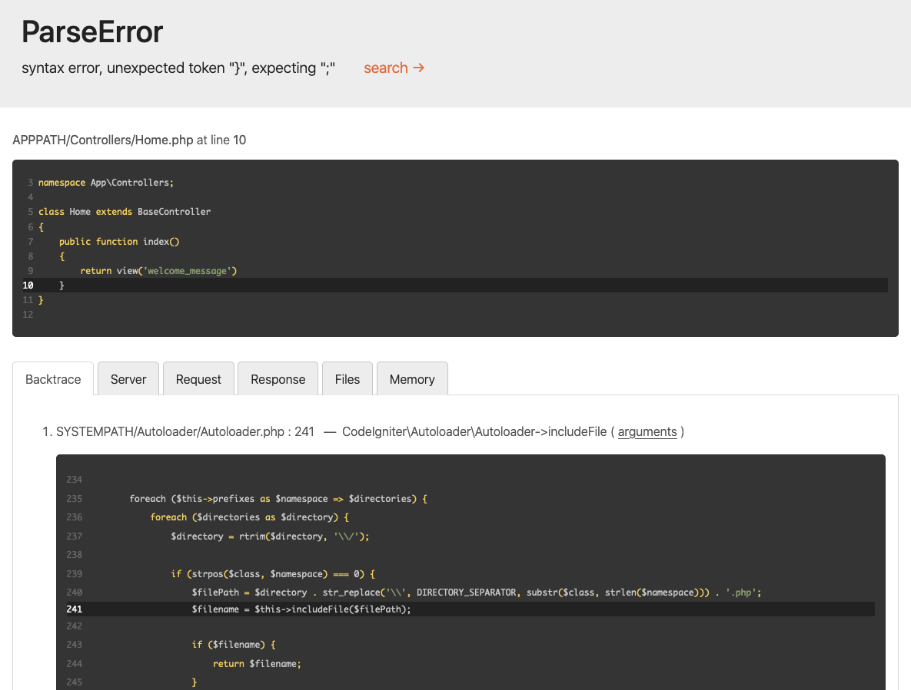

# Error Handling

CodeIgniter builds error reporting into your system through Exceptions, both the \[SPL collection](#https://www.php.net/manual/en/spl.exceptions.php)\_, as well as a few exceptions that are provided by the framework.

Depending on your environment's setup, the default action when an error or exception is thrown is to display a detailed error report unless the application is running under the `production` environment. In the `production` environment, a more generic message is displayed to keep the best user experience for your users.

- [Using Exceptions](#using-exceptions)
- [Configuration](#configuration)
    - [Error Reporting](#error-reporting)
    - [Logging Exceptions](#logging-exceptions)
- [Framework Exceptions](#framework-exceptions)
    - [PageNotFoundException](#pagenotfoundexception)
    - [ConfigException](#configexception)
    - [DatabaseException](#databaseexception)
    - [RedirectException](#redirectexception)
- [Specify HTTP Status Code in Your Exception](#specify-http-status-code-in-your-exception)
- [Specify Exit Code in Your Exception](#specify-exit-code-in-your-exception)
- [Logging Deprecation Warnings](#logging-deprecation-warnings)
- [Custom Exception Handlers](#custom-exception-handlers)
    - [Defining the New Handler](#defining-the-new-handler)
    - [Configuring the New Handler](#configuring-the-new-handler)

## Using Exceptions

This section is a quick overview for newer programmers, or for developers who are not experienced with using exceptions.

Exceptions are simply events that happen when the exception is "thrown". This halts the current flow of the script, and execution is then sent to the error handler which displays the appropriate error page:

```php
--8<--
general/errors/001.php
--8<--
```

If you are calling a method that might throw an exception, you can catch that exception using a `try/catch` block:

```php
--8<--
general/errors/002.php
--8<--
```

If the `$userModel` throws an exception, it is caught and the code within the catch block is executed. In this example, the scripts dies, echoing the error message that the `UserModel` defined.

In the example above, we catch any type of Exception. If we only want to watch for specific types of exceptions, like a `UnknownFileException`, we can specify that in the catch parameter. Any other exceptions that are thrown and are not child classes of the caught exception will be passed on to the error handler:

```php
--8<--
general/errors/003.php
--8<--
```

This can be handy for handling the error yourself, or for performing cleanup before the script ends. If you want the error handler to function as normal, you can throw a new exception within the catch block:

```php
--8<--
general/errors/004.php
--8<--
```

## Configuration

### Error Reporting

By default, CodeIgniter will display a detailed error report with all errors in the `development` and `testing` environments, and will not display any errors in the `production` environment.



You can change your environment by setting the `CI_ENVIRONMENT` variable. See `setting-environment`.

!!! important "Important"
    Disabling error reporting DOES NOT stop logs from being written if there are errors.

!!! warning "Warning"
    Note that your settings from the **.env** file are added to `$_SERVER` and `$_ENV`. As a side effect, this means that if the detailed error report is displayed, **your secure credentials are publicly exposed**.

### Logging Exceptions

By default, all Exceptions other than 404 - Page Not Found exceptions are logged. This can be turned on and off by setting the `$log` value of **app/Config/Exceptions.php**:

```php
--8<--
general/errors/005.php
--8<--
```

To ignore logging on other status codes, you can set the status code to ignore in the same file:

```php
--8<--
general/errors/006.php
--8<--
```

!!! note "Note"
    It is possible that logging still will not happen for exceptions if your current Log settings are not set up to log **critical** errors, which all exceptions are logged as.

## Framework Exceptions

The following framework exceptions are available:

### PageNotFoundException

This is used to signal a 404, Page Not Found error. When thrown, the system will show the view found at **app/Views/errors/html/error_404.php**. You should customize all of the error views for your site. If, in **app/Config/Routes.php**, you have specified a 404 Override, that will be called instead of the standard 404 page:

```php
--8<--
general/errors/007.php
--8<--
```

You can pass a message into the exception that will be displayed in place of the default message on the 404 page.

### ConfigException

This exception should be used when the values from the configuration class are invalid, or when the config class is not the right type, etc:

```php
--8<--
general/errors/008.php
--8<--
```

This provides an exit code of 3.

### DatabaseException

This exception is thrown for database errors, such as when the database connection cannot be created, or when it is temporarily lost:

```php
--8<--
general/errors/009.php
--8<--
```

This provides an exit code of 8.

### RedirectException

!!! note "Note"
    Since v4.4.0, the namespace of `RedirectException` has been changed. Previously it was `CodeIgniter\Router\Exceptions\RedirectException`. The previous class is deprecated.

This exception is a special case allowing for overriding of all other response routing and forcing a redirect to a specific URI:

```php
--8<--
general/errors/010.php
--8<--
```

`$uri` is a URI path relative to baseURL. You can also supply a redirect code to use instead of the default (`302`, "temporary redirect"):

```php
--8<--
general/errors/011.php
--8<--
```

Also, since v4.4.0 an object of a class that implements ResponseInterface can be used as the first argument. This solution is suitable for cases where you need to add additional headers or cookies in the response.

```php
--8<--
general/errors/018.php
--8<--
```

## Specify HTTP Status Code in Your Exception

!!! success "Available from version 4.3.0"

Since v4.3.0, you can specify the HTTP status code for your Exception class to implement `HTTPExceptionInterface`.

When an exception implementing `HTTPExceptionInterface` is caught by CodeIgniter's exception handler, the Exception code will become the HTTP status code.

## Specify Exit Code in Your Exception

!!! success "Available from version 4.3.0"

Since v4.3.0, you can specify the exit code for your Exception class to implement `HasExitCodeInterface`.

When an exception implementing `HasExitCodeInterface` is caught by CodeIgniter's exception handler, the code returned from the `getExitCode()` method will become the exit code.

## Logging Deprecation Warnings

!!! success "Available from version 4.3.0"

By default, all errors reported by `error_reporting()` will be thrown as an `ErrorException` object. These include both `E_DEPRECATED` and `E_USER_DEPRECATED` errors. With the surge in use of PHP 8.1+, many users may see exceptions thrown for \[passing null to non-nullable arguments of internal functions](#https://wiki.php.net/rfc/deprecate-null-to-scalar-internal-arg)\_. To ease the migration to PHP 8.1, you can instruct CodeIgniter to log the deprecations instead of throwing them.

First, make sure your copy of `Config\Exceptions` is updated with the two new properties and set as follows:

```php
--8<--
general/errors/012.php
--8<--
```

Next, depending on the log level you set in `Config\Exceptions::$deprecationLogLevel`, check whether the logger threshold defined in `Config\Logger::$threshold` covers the deprecation log level. If not, adjust it accordingly.

```php
--8<--
general/errors/013.php
--8<--
```

After that, subsequent deprecations will be logged instead of thrown.

This feature also works with user deprecations:

```php
--8<--
general/errors/014.php
--8<--
```

For testing your application you may want to always throw on deprecations. You may configure this by setting the environment variable `CODEIGNITER_SCREAM_DEPRECATIONS` to a truthy value.

## Custom Exception Handlers

!!! success "Available from version 4.4.0"

If you need more control over how exceptions are displayed you can now define your own handlers and specify when they apply.

### Defining the New Handler

The first step is to create a new class which implements `CodeIgniter\Debug\ExceptionHandlerInterface`. You can also extend `CodeIgniter\Debug\BaseExceptionHandler`. This class includes a number of utility methods that are used by the default exception handler. The new handler must implement a single method: `handle()`:

```php
--8<--
general/errors/015.php
--8<--
```

This example defines the minimum amount of code typically needed - display a view and exit with the proper exit code. However, the `BaseExceptionHandler` provides a number of other helper functions and objects.

### Configuring the New Handler

Telling CodeIgniter to use your new exception handler class is done in the **app/Config/Exceptions.php** configuration file's `handler()` method:

```php
--8<--
general/errors/016.php
--8<--
```

You can use any logic your application needs to determine whether it should handle the exception, but the two most common are checking on the HTTP status code or the type of exception. If your class should handle it then return a new instance of that class:

```php
--8<--
general/errors/017.php
--8<--
```
