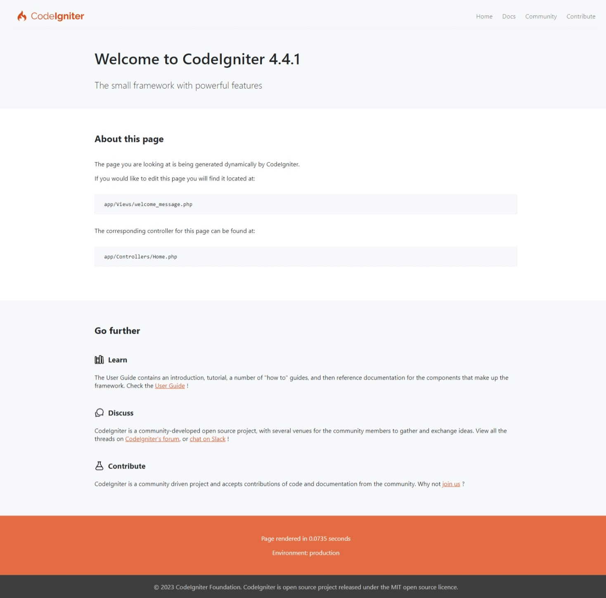

# Troubleshooting

Here are some common installation problems, and suggested workarounds.

<div class="contents" local="" depth="2">

</div>

## How do I know if my install is working?

From the command line, at your project root:

``` console
php spark serve
```

`http://localhost:8080` in your browser should then show the default
welcome page:



## I have to include index.php in my URL

If a URL like `/mypage/find/apple` doesn't work, but the similar URL
`/index.php/mypage/find/apple` does, that sounds like your **.htaccess**
rules (for Apache) are not set up properly, or the `mod_rewrite`
extension in Apache's **httpd.conf** is commented out. See
`urls-remove-index-php`.

## Only the default page loads

If you find that no matter what you put in your URL only your default
page is loading, it might be that your server does not support the
REQUEST_URI variable needed to serve search-engine friendly URLs. As a
first step, open your **app/Config/App.php** file and look for the URI
Protocol information. It will recommend that you try a couple of
alternate settings. If it still doesn't work after you've tried this
you'll need to force CodeIgniter to add a question mark (`?`) to your
URLs. To do this open your **app/Config/App.php** file and change this:

<div class="literalinclude">

troubleshooting/001.php

</div>

To this:

<div class="literalinclude">

troubleshooting/002.php

</div>

## No input file specified

If you see "No input file specified", try to change the rewrite rule
like the following (to add `?` after `index.php`):

``` apache
RewriteRule ^([\s\S]*)$ index.php?/$1 [L,NC,QSA]
```

## My app works fine locally but not on the production server

Make sure that the case of the folder and file names matches the code.

Many developers develop on case-insensitive file systems on Windows or
macOS. However, most server environments use case-sensitive file
systems.

For example, when you have **app/Controllers/Product.php**, you must use
`Product` as the short classname, not `product`.

If the file name case is incorrect, the file is not found on the server.

## The tutorial gives 404 errors everywhere :(

You can't follow the tutorial using PHP's built-in web server. It
doesn't process the **.htaccess** file needed to route requests
properly.

The solution: use Apache to serve your site, or else the built-in
CodeIgniter equivalent, `php spark serve` from your project root.

## What's with an unhelpful "Whoops!" page?

You find that your app is displaying a page with "Whoops!" and then the
text line "We seem to have hit a snag. Please try again later...".

That is a sign that you are in production mode and have hit an
unrecoverable error, which we don't want to show to the viewer of the
webapp, for better security.

You can see the error in the log file. See [CodeIgniter Error
Logs](#codeigniter-error-logs) below.

If you reach this page while developing you should change your
environment to "development" (in **.env**). See
`setting-development-mode` for more details. After that, reload the
page. You will see the error and the back trace.

## CodeIgniter Error Logs

CodeIgniter logs error messages, according to the settings in
**app/Config/Logger.php**.

You can adjust the error threshold to see more or fewer messages. See
`Logging <logging-configuration>` for details.

The default configuration has daily log files stored in
**writable/logs**. It would be a good idea to check them if things
aren't working the way you expect!
