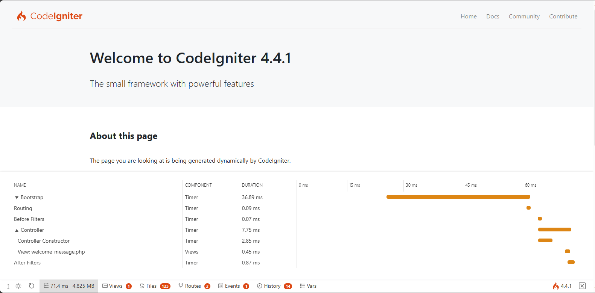

# Build Your First Application

<div class="contents" local="" depth="2">

</div>

## Overview

This tutorial is intended to introduce you to the CodeIgniter4 framework
and the basic principles of MVC architecture. It will show you how a
basic CodeIgniter application is constructed in a step-by-step fashion.

If you are not familiar with PHP, we recommend that you check out the
[W3Schools PHP Tutorial](https://www.w3schools.com/php/default.asp)
before continuing.

In this tutorial, you will be creating a **basic news application**. You
will begin by writing the code that can load static pages. Next, you
will create a news section that reads news items from a database.
Finally, you'll add a form to create news items in the database.

This tutorial will primarily focus on:

- Model-View-Controller basics
- Routing basics
- Form validation
- Performing basic database queries using CodeIgniter's Model

The entire tutorial is split up over several pages, each explaining a
small part of the functionality of the CodeIgniter framework. You'll go
through the following pages:

- Introduction, this page, which gives you an overview of what to expect
  and gets your default application downloaded and running.
- `Static pages <static_pages>`, which will teach you the basics of
  controllers, views and routing.
- `News section <news_section>`, where you'll start using models and
  will be doing some basic database operations.
- `Create news items <create_news_items>`, which will introduce more
  advanced database operations and form validation.
- `Conclusion <conclusion>`, which will give you some pointers on
  further reading and other resources.

Enjoy your exploration of the CodeIgniter framework.

<div class="toctree" hidden="" titlesonly="">

static_pages news_section create_news_items conclusion

</div>

## Getting Up and Running

### Installing CodeIgniter

You can download a release manually from the site, but for this tutorial
we will use the recommended way and install the AppStarter package
through Composer. From your command line type the following:

``` console
composer create-project codeigniter4/appstarter ci-news
```

This creates a new folder, **ci-news**, which contains your application
code, with CodeIgniter installed in the vendor folder.

### Setting Development Mode

By default, CodeIgniter starts up in production mode. This is a safety
feature to keep your site a bit more secure in case settings are messed
up once it is live. So first let's fix that. Copy or rename the **env**
file to **.env**. Open it up.

This file contains server-specific settings. This means you never will
need to commit any sensitive information to your version control system.
It includes some of the most common ones you want to enter already,
though they are all commented out. So uncomment the line with
`CI_ENVIRONMENT` on it, and change `production` to `development`:

    CI_ENVIRONMENT = development

### Running Development Server

With that out of the way it's time to view your application in a
browser. You can serve it through any server of your choice, Apache,
nginx, etc, but CodeIgniter comes with a simple command that takes
advantage of PHP's built-in server to get you up and running fast on
your development machines. Type the following on the command line from
the root of your project:

``` console
php spark serve
```

## The Welcome Page

Now point your browser to the correct URL you will be greeted by a
welcome screen. Try it now by heading to the following URL:

    http://localhost:8080

and you should be greeted by the following page:


This means that your application works and you can start making changes
to it.

## Debugging

### Debug Toolbar

Now that you're in development mode, you'll see the CodeIgniter flame on
the right bottom of your application. Click it and you'll see the debug
toolbar.

This toolbar contains a number of helpful items that you can reference
during development. This will never show in production environments.
Clicking any of the tabs along the bottom brings up additional
information. Clicking the X on the right of the toolbar minimizes it to
a small square with the CodeIgniter flame on it. If you click that the
toolbar will show again.



### Error Pages

In addition to this, CodeIgniter has some helpful error pages when you
hit exceptions or other errors in your program. Open up
**app/Controllers/Home.php** and change some line to generate an error
(removing a semi-colon or brace should do the trick!). You will be
greeted by a screen looking something like this:


There are a couple of things to note here:

1.  Hovering over the red header at the top reveals a **search** link
    that will open up DuckDuckGo.com in a new tab and searching for the
    exception.
2.  Clicking the **arguments** link on any line in the Backtrace will
    expand a list of the arguments that were passed into that function
    call.

Everything else should be clear when you see it.

Now that we know how to get started and how to debug a little, let's get
started building this small news application.
